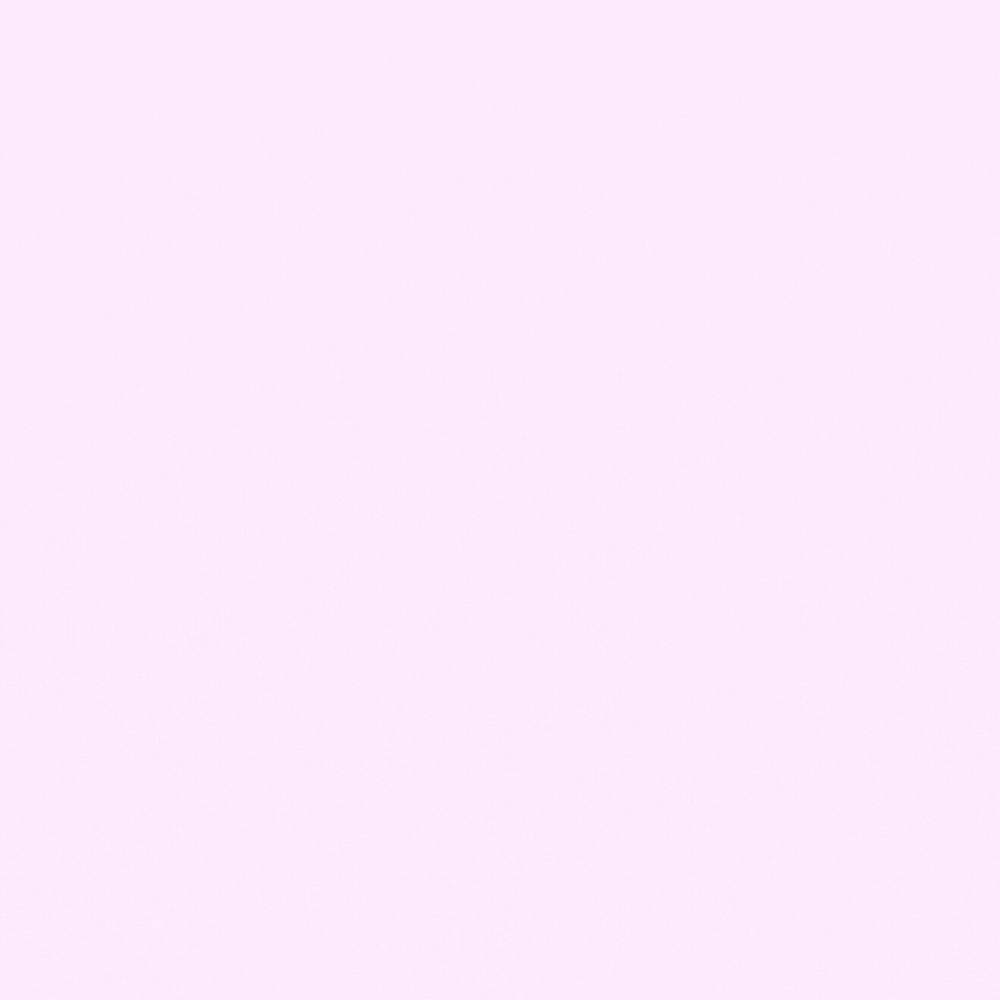

<iframe src="/workspaces/rodrigojsfreitas/doc.html" width="100%" height="500px"></iframe>

 
  
    

  
  
  
  
  
  
  
  

<!-- ===== 🎨 DEMO: TÉCNICAS DE BACKGROUND PARA README GITHUB ===== -->

<h2 align="center">🎨 Como Mudar o Background do README - Exemplos Práticos</h2>

<!-- Método 1: Banner com gradiente personalizado usando capsule-render -->

<!-- Método 2: Background de seção com HTML/CSS inline - Gradiente -->

  <h3 style="color: white; margin: 0; text-align: center;">✨ Método 2: Background Gradiente com HTML/CSS</h3>
  

    💡 <strong>Código:</strong> <code style="background: rgba(255,255,255,0.2); padding: 2px 6px; border-radius: 4px;">&lt;div style="background: linear-gradient(135deg, #667eea 0%, #764ba2 100%);"&gt;</code>
  

<!-- Método 3: Background sólido colorido -->

  <h3 style="color: #68d391; margin: 0; text-align: center;">🔹 Método 3: Background Sólido</h3>
  

    💡 <strong>Código:</strong> <code style="background: #1a202c; color: #68d391; padding: 2px 6px; border-radius: 4px;">&lt;div style="background-color: #2d3748;"&gt;</code>
  

<!-- Método 4: Background com sombra e efeitos -->

  <h3 style="color: #2d3748; margin: 0; text-align: center;">🌟 Método 4: Background Claro com Sombra</h3>
  

    💡 <strong>Código:</strong> <code style="background: #edf2f7; color: #2d3748; padding: 2px 6px; border-radius: 4px;">box-shadow: 0 10px 25px rgba(0,0,0,0.1)</code>
  

<!-- Método 5: Background com pattern CSS -->

  <h3 style="color: #ffd700; margin: 0; text-align: center; text-shadow: 2px 2px 4px rgba(0,0,0,0.5);">🎯 Método 5: Background com Padrão</h3>
  

    💡 <strong>Padrão CSS criado com gradientes lineares</strong>
  

<!-- Método 6: Diferentes cores de banner com capsule-render -->
<h4 align="center" style="margin: 30px 0 15px 0; color: #4a5568;">🎨 Variações de Cores para Banners:</h4>

  
<!-- Banner Azul -->

<!-- Banner Roxo -->

<!-- Banner Verde (original) -->

<!-- Banner Vermelho -->

<h2 align="center">📊 Minhas Estatísticas no GitHub 📊 </h2>

  
  

<h2 align="center">🌟 Meus Projetos Favoritos 🌟</h2>

  
  
  
  

  
  
  

<h2 align="center">📱 Sobre mim 💻</h2>

  Sou um jovem estudante de Análise e desenvolvimento de Sistema na Estácio. Sempre tive muito interesse em tecnologia, mas apenas como hobby, porém tudo mudou quando aprendi minha primeira linguagem de programação (python) que me deu uma nova perpectiva sobre como a tecnologia pode solucionar problemas de diferentes maneiras.

<!-- ===== 📚 GUIA PRÁTICO: CÓDIGOS PARA COPIAR ===== -->

  <h2 style="color: #68d391; margin: 0 0 20px 0; text-align: center;">📚 Guia Prático - Códigos para Copiar e Usar</h2>
  
  <h3 style="color: #ffd700; margin: 15px 0 10px 0;">1. 🌊 Banner com Cores Personalizadas (capsule-render.vercel.app)</h3>
  

    <code style="color: #e2e8f0; font-family: 'Courier New', monospace; font-size: 13px;">
      &lt;img width=100% src="https://capsule-render.vercel.app/api?type=waving&color=SUA_COR&height=200" /&gt;
    </code>
    
Substitua 'SUA_COR' por: 00cb93 (verde), 0066cc (azul), 6a0dad (roxo), dc3545 (vermelho)

  

  
  <h3 style="color: #ffd700; margin: 15px 0 10px 0;">2. 🎨 Background Gradiente com HTML/CSS</h3>
  

    <code style="color: #e2e8f0; font-family: 'Courier New', monospace; font-size: 13px;">
      &lt;div style="background: linear-gradient(135deg, #667eea 0%, #764ba2 100%); padding: 20px; border-radius: 15px;"&gt; 
      &nbsp;&nbsp;&lt;h3 style="color: white; text-align: center;"&gt;Seu Título&lt;/h3&gt; 
      &nbsp;&nbsp;&lt;p style="color: white; text-align: center;"&gt;Seu conteúdo&lt;/p&gt; 
      &lt;/div&gt;
    </code>
  

  
  <h3 style="color: #ffd700; margin: 15px 0 10px 0;">3. 🎯 Background Sólido com Bordas</h3>
  

    <code style="color: #e2e8f0; font-family: 'Courier New', monospace; font-size: 13px;">
      &lt;div style="background-color: #2d3748; padding: 20px; border-radius: 10px; border-left: 5px solid #68d391;"&gt; 
      &nbsp;&nbsp;&lt;h3 style="color: #68d391; text-align: center;"&gt;Título Verde&lt;/h3&gt; 
      &nbsp;&nbsp;&lt;p style="color: #e2e8f0; text-align: center;"&gt;Texto claro&lt;/p&gt; 
      &lt;/div&gt;
    </code>
  

  
  <h3 style="color: #ffd700; margin: 15px 0 10px 0;">4. ✨ Background com Sombra e Efeitos</h3>
  

    <code style="color: #e2e8f0; font-family: 'Courier New', monospace; font-size: 13px;">
      &lt;div style="background: #f7fafc; padding: 20px; border-radius: 15px; box-shadow: 0 10px 25px rgba(0,0,0,0.1);"&gt; 
      &nbsp;&nbsp;&lt;h3 style="color: #2d3748; text-align: center;"&gt;Título Escuro&lt;/h3&gt; 
      &nbsp;&nbsp;&lt;p style="color: #4a5568; text-align: center;"&gt;Texto escuro&lt;/p&gt; 
      &lt;/div&gt;
    </code>
  

  
  <h3 style="color: #ffd700; margin: 15px 0 10px 0;">💡 Dicas Importantes:</h3>
  <ul style="color: #e2e8f0; margin: 10px 0 0 20px; font-size: 14px;">
    <li>Use sempre <code style="background: #4a5568; color: #ffd700; padding: 2px 4px; border-radius: 3px;">style=""</code> com aspas duplas</li>
    <li>Para cores hex, use formato <code style="background: #4a5568; color: #ffd700; padding: 2px 4px; border-radius: 3px;">#RRGGBB</code> (ex: #ff6b6b)</li>
    <li>GitHub suporta HTML/CSS inline básico nos READMEs</li>
    <li>Teste sempre as mudanças commitando e visualizando no GitHub</li>
  </ul>

