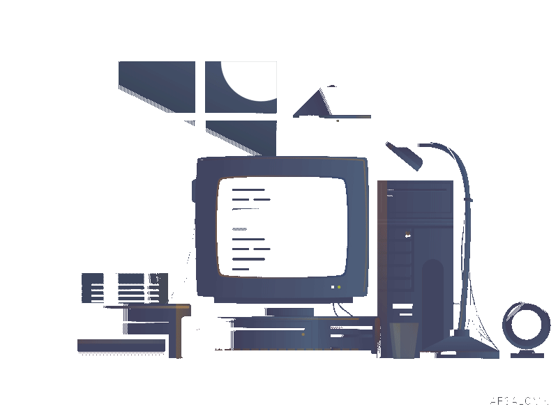

 
  
    

  
  
  
  
  
  
  
  

<h2 align="center">📊 Minhas Estatísticas no GitHub 📊 </h2>

  

  

<h2 align="center">🌟 Meus Projetos Favoritos 🌟</h2>

  
  
  
  

  
  
  

<h2 align="center">📱 Sobre mim 💻</h2>

  Sou um jovem estudante de Análise e desenvolvimento de Sistema na Estácio. Sempre tive muito interesse em tecnologia, mas apenas como hobby, porém tudo mudou quando aprendi minha primeira linguagem de programação (python) que me deu uma nova perpectiva sobre como a tecnologia pode solucionar problemas de diferentes maneiras.

